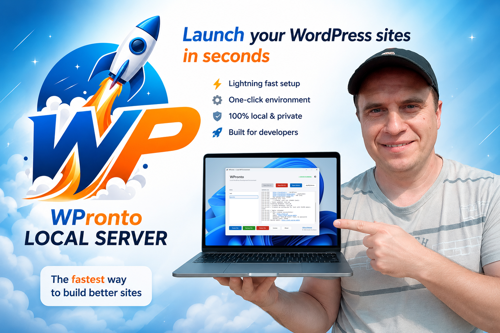

# WPronto site

# WPronto

> Fast, Simple & Powerful local WordPress development environment for Windows

---

## Information

| Parameter | Value |
|---|---|
| **Version** | `1.0` |
| **Author** | Andrii Ovcharov |
| **Release Date** | `05/17/2026` |
| **Version** | `2.0` |
| **Author** | Andrii Ovcharov |
| **Release Date** | `05/27/2026` |

---

# Description

WPronto is a local WordPress server for Windows.

It provides a complete local development stack including:

- Nginx
- PHP
- MySQL

This allows developers to create and manage WordPress websites locally without external hosting or complicated manual configuration.

---

# Installed Components

| Component | Version |
|---|---|
| **WordPress** | `7.0` |
| **PHP** | `8.3/8.5` |
| **Nginx** | `1.30.2` |
| **phpMyAdmin** | `5.2.3` |
| **MySQL (MariaDB)** | `11.4.2` |

---

# Features

- One-click start/stop for the full server stack  
  *(Nginx + PHP + MySQL)*

- Automatic WordPress installation

- Multiple WordPress sites management

- Built-in phpMyAdmin integration

- Automatic database creation

- Automatic `wp-config.php` generation

---

# System Requirements

| Requirement | Details |
|---|---|
| **Operating System** | Windows 10 / 11 (64-bit) |
| **Runtime** | .NET 8.0 Desktop Runtime |
| **Disk Space** | 2GB free space recommended |
| **Memory** | 8GB RAM recommended |

---

# License

WPronto is free software released under the **MIT License**.

---

## 👤 Author

**Andrii Ovcharov**  
📧 ovcharovcoder@gmail.com

